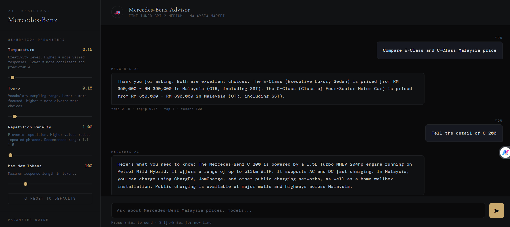

# 🚗 GPT-2 Mercedes Bot

A fine-tuned GPT-2 Medium language model trained on Mercedes-Benz Malaysia Q&A data, capable of answering questions about Mercedes-Benz car prices, models, and specifications in the Malaysian market.

---

## Overview

This project fine-tunes **GPT-2 Medium** (355M parameters) on a custom Mercedes-Benz Malaysia Q&A dataset. The goal is to build a domain-specific chatbot that can accurately answer queries about Mercedes-Benz vehicle pricing, variants, and specifications available in Malaysia.

The model was trained on **Google Colab (T4 GPU)** with automatic checkpoint saving to Google Drive to handle session disconnections.

---

## Model Architecture

| Parameter | Value |
|-----------|-------|
| Base model | `gpt2-medium` |
| Parameters | 355M |
| Architecture | Decoder-only Transformer |
| Max sequence length | 256 tokens |
| Training precision | FP16 (mixed precision) |

---

## Preview


---

## Dataset

The training data is a CSV file with a single `text` column, where each entry follows this Q&A format:

```
<|startoftext|>Question: What is the price of the Mercedes-Benz E 200 in Malaysia?
Answer: The Mercedes-Benz E 200 is priced at RM XXX,XXX in Malaysia.<|endoftext|>
```

| Property | Value |
|----------|-------|
| Format | CSV with `text` column |
| Train / Eval split | 90% / 10% (seed=42) |
| Domain | Mercedes-Benz Malaysia pricing & specs |

---

## Training

Training was conducted on Google Colab using a T4 GPU with the following hyperparameters:

| Hyperparameter | Value |
|----------------|-------|
| Epochs | 3 |
| Train batch size | 4 |
| Eval batch size | 4 |
| Warmup steps | 50 |
| Weight decay | 0.01 |
| Eval strategy | Every 500 steps |
| Save strategy | Every 500 steps |
| Best model | Loaded at end of training |
| Mixed precision | FP16 |

### Training Log

| Step | Training Loss | Validation Loss |
|------|--------------|----------------|
| 500 | 0.2784 | 0.2693 |
| 1000 | 0.1631 | 0.1811 |
| 1500 | 0.1749 | 0.1601 |
| 2000 | 0.1487 | 0.1504 |
| 2500 | 0.1468 | 0.1421 |
| 3000 | 0.1395 | 0.1395 |
| 3500 | 0.1470 | 0.1378 |
| 4000 | 0.1356 | 0.1357 |
| 4500 | 0.1413 | 0.1341 |

Both training and validation loss converged steadily over 4,773 total steps across 3 epochs. The close alignment between training and validation loss indicates **no significant overfitting**.

---

## Evaluation Results

The model was evaluated on the held-out 10% eval set after training.

| Metric | Value |
|--------|-------|
| **Eval Loss** | **0.1341** |
| **Perplexity** | **1.14** |

### Perplexity Benchmark Comparison

| Model | Perplexity |
|-------|-----------|
| Random baseline | ~5,000+ |
| GPT-2 Medium (no fine-tuning) | ~35 |
| **This model (fine-tuned)** | **1.14** ✅ |

A perplexity of **1.14** (close to the theoretical minimum of 1.0) indicates the model has learned the domain data distribution very well. The loss gap between training and validation remained near zero throughout training, confirming strong generalization on the Q&A domain.

> **Note:** The very low perplexity is expected for a domain-specific fine-tuned model trained on a focused dataset. It reflects the model's confidence on in-distribution questions. Performance on out-of-distribution queries may vary.

---

### Generation Parameters

| Parameter | Default | Range | Description |
|-----------|---------|-------|-------------|
| `temperature` | 0.7 | 0.1 – 2.0 | Controls randomness. Lower = more deterministic, higher = more creative. |
| `top_p` | 0.9 | 0.1 – 1.0 | Nucleus sampling threshold. Restricts token selection to the top cumulative probability mass. |
| `repetition_penalty` | 1.2 | 1.0 – 2.0 | Penalises repeated tokens. Higher values reduce repetitive output. |
| `max_new_tokens` | 150 | 30 – 400 | Maximum number of tokens to generate per response. |

**Recommended presets:**

| Use Case | Temperature | Top-p | Repetition Penalty |
|----------|------------|-------|--------------------|
| Precise price queries | 0.3 | 0.7 | 1.3 |
| General enquiries | 0.7 | 0.9 | 1.2 |
| Descriptive / creative | 1.0 | 0.95 | 1.1 |

---


### Features

- Chat interface with message history
- Live sliders for all generation parameters (temperature, top-p, repetition penalty, max tokens)
- Parameter presets for common use cases
- Each bot response displays the exact parameters used — useful for comparing outputs

---

## Project Structure

```
mercedes-chatbot/
├── model/                          # Fine-tuned model files (download from Google Drive)
│   ├── config.json                 # Model architecture config
│   ├── generation_config.json      # Default generation parameters
│   ├── model.safetensors           # Model weights (1.32 GB)
│   ├── tokenizer.json              # Tokenizer vocabulary
│   └── tokenizer_config.json       # Tokenizer settings
│
├── app.py                          # Flask backend (API + serves index.html)
├── index.html                      # Web chat UI
├── requirements.txt                # Python dependencies
├── gpt2_finetune_mercedes.ipynb    # Training notebook (Google Colab)
└── README.md
```

---


## Acknowledgements

- [HuggingFace Transformers](https://github.com/huggingface/transformers) — model training and inference
- [OpenAI GPT-2](https://github.com/openai/gpt-2) — base model
- Google Colab — T4 GPU training environment
